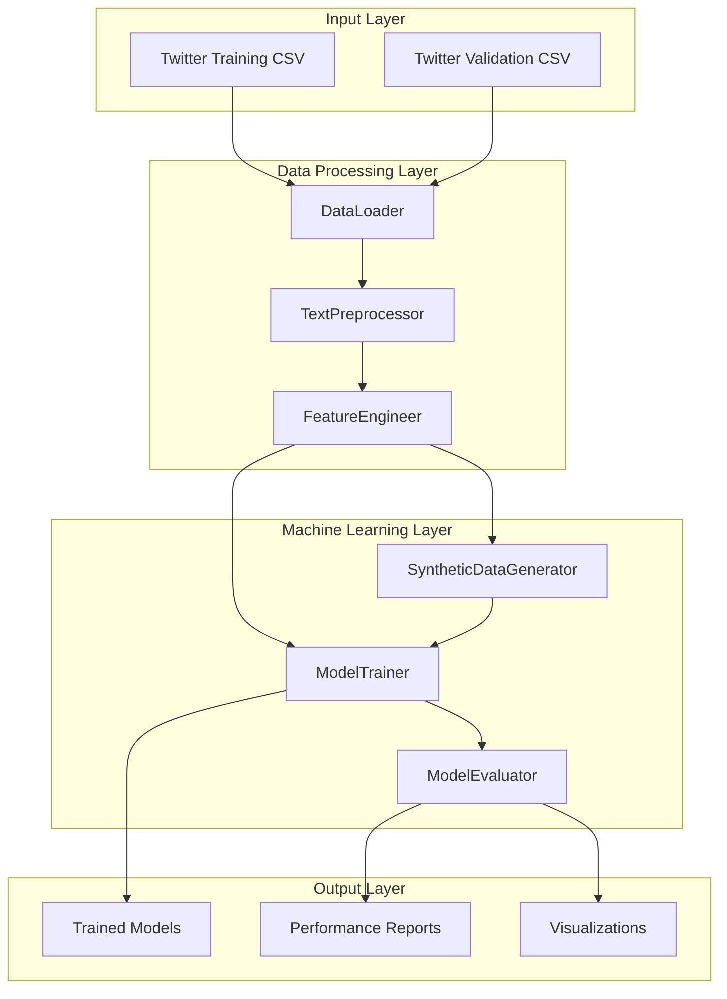
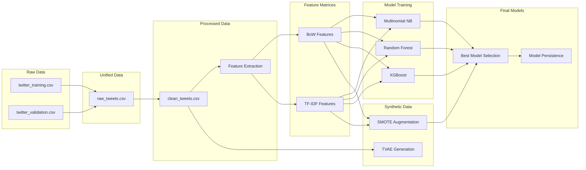
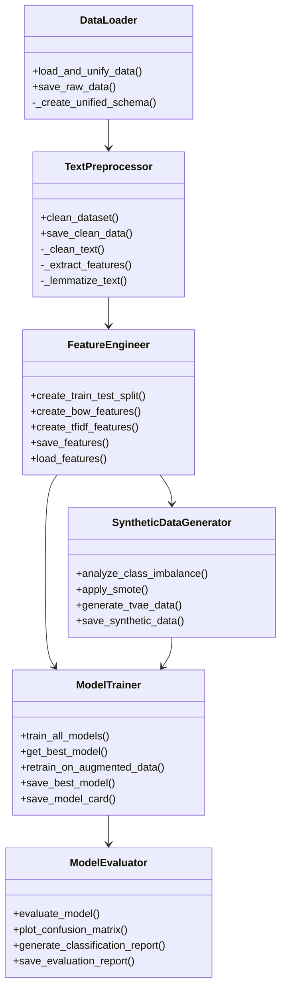
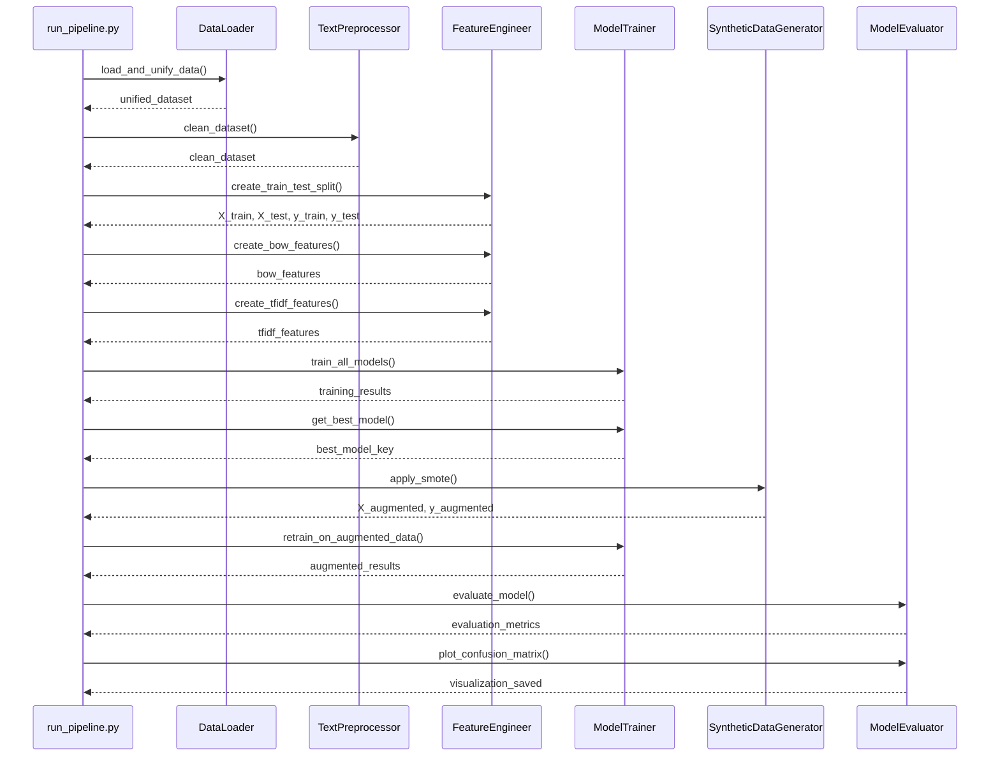
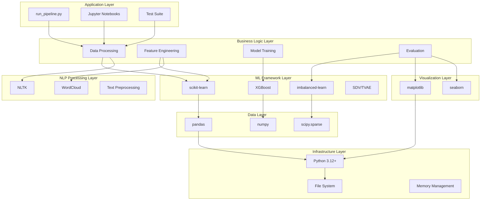
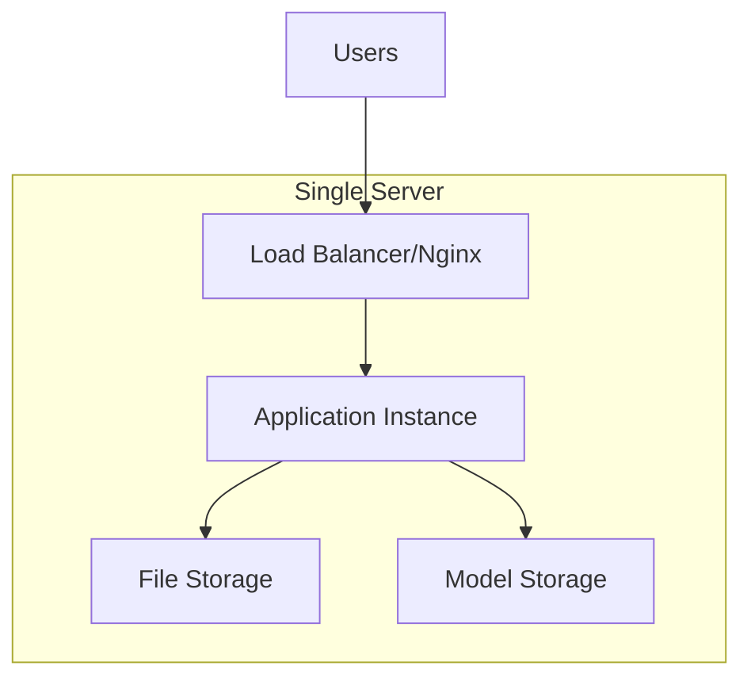
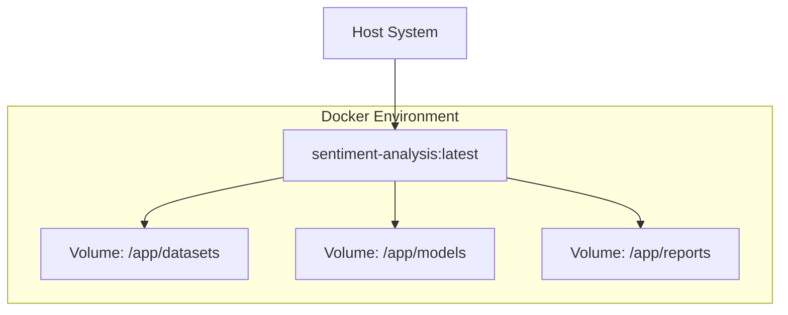
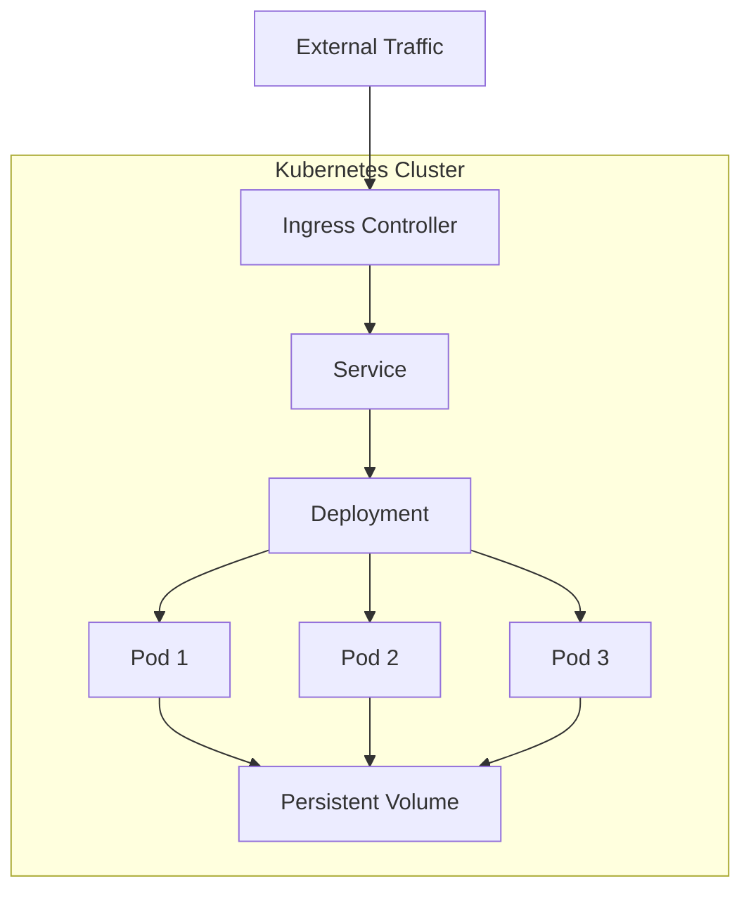
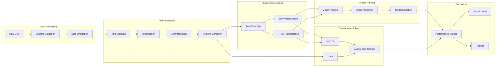

# Architecture Diagrams

## System Architecture Overview



## Data Flow Architecture



## Component Interaction Diagram



## Pipeline Execution Flow



## File System Architecture

```
SocialMedia_SentimentAnalysis/
├── datasets/                    # Data Storage Layer
│   ├── twitter_training.csv    # Input: Training data
│   ├── twitter_validation.csv  # Input: Validation data
│   ├── raw_tweets.csv          # Processed: Unified raw data
│   ├── clean_tweets.csv        # Processed: Clean data
│   └── synthetic_tvae_data.csv # Generated: Synthetic data
│
├── features/                    # Feature Storage Layer
│   ├── bow.npz                 # BoW feature matrices
│   ├── tfidf.npz              # TF-IDF feature matrices
│   ├── bow_vocab.pkl          # BoW vocabulary
│   └── tfidf_vocab.pkl        # TF-IDF vocabulary
│
├── models/                      # Model Storage Layer
│   ├── best_model_*.pkl        # Serialized models
│   └── model_card.json         # Model metadata
│
├── reports/                     # Output Layer
│   ├── eda/                    # Exploratory Data Analysis
│   │   ├── overview_analysis.png
│   │   └── sentiment_wordclouds.png
│   └── evaluation/             # Model Evaluation
│       └── confusion_matrices.png
│
├── src/                         # Core Logic Layer
│   ├── __init__.py
│   ├── data_loader.py          # Data ingestion
│   ├── preprocessor.py         # Text processing
│   ├── feature_engineer.py     # Feature creation
│   ├── model_trainer.py        # ML training
│   ├── synthetic_generator.py  # Data augmentation
│   └── evaluator.py           # Performance evaluation
│
├── tests/                       # Testing Layer
│   ├── test_pipeline.py        # Integration tests
│   └── main.ipynb             # Interactive notebook
│
├── docs/                        # Documentation Layer
│   ├── COMPREHENSIVE_DOCUMENTATION.md
│   ├── API_REFERENCE.md
│   ├── QUICK_START_GUIDE.md
│   └── ARCHITECTURE_DIAGRAM.md
│
├── run_pipeline.py             # Main Execution Script
├── requirements.txt            # Dependencies
└── README.md                   # Project Overview
```

## Technology Stack Architecture



## Deployment Architecture Options

### Single Server Deployment


### Containerized Deployment


### Kubernetes Deployment


## Data Processing Pipeline



This architecture provides a comprehensive view of how the SocialMedia Sentiment Analysis system is structured, from high-level components down to detailed data flows and deployment options.
